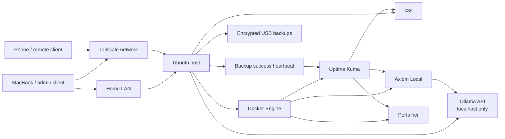

# Danzee Homelab

[](https://github.com/Aydanzee/danzee-homelab/actions/workflows/validate.yml)

A compact, security-conscious Ubuntu homelab for containers, Kubernetes, private AI, remote access, monitoring, and encrypted USB backups.

Built on an older laptop to prove that useful infrastructure does not need expensive hardware.

## Tested environment

- Ubuntu 24.04.4 LTS
- Intel Core i5-6200U
- 4 GB RAM with 4 GB swap
- 500 GB internal disk
- k3s `v1.35.5+k3s1`
- Ollama `0.30.8`
- 32 GB exFAT USB backup drive

The automation remains configurable, but these are the versions and resource limits used by the reference build.

## What is running

| Layer | Tool | Purpose |
|---|---|---|
| Host | Ubuntu Server/Desktop 24.04 LTS | Base operating system |
| Containers | Docker Engine + Compose | Portainer, MariaDB, Uptime Kuma, app workloads |
| Kubernetes | k3s | Lightweight single-node cluster and lab workloads |
| Private networking | Tailscale | Encrypted remote SSH and app access |
| Firewall | UFW | LAN- and Tailscale-scoped inbound access |
| Local AI | Ollama | CPU-friendly local model serving |
| AI interface | Axiom Local | Private browser UI for local models; source kept separately |
| Monitoring | Uptime Kuma | Service health and status checks |
| Backups | systemd + OpenSSL + USB | Nightly encrypted backups with validation and retention |

## Current design



## Security posture

- Default inbound policy is deny.
- SSH is permitted only from the trusted home LAN and the `tailscale0` interface.
- Private app access is limited to the trusted LAN and Tailscale.
- Ollama listens on `127.0.0.1`, not the public network.
- Backup archives are encrypted with AES-256-CBC using PBKDF2 before being written to USB.
- Portainer and Uptime Kuma are stopped briefly while their persistent volumes are archived, then restarted even if the backup fails.
- The reference k3s and Ollama versions are pinned in the example configuration.
- The backup passphrase is root-only; a separate recovery copy must be stored off-host.
- Secrets, `.env` files, recovery keys, database dumps, Tailscale addresses, and live backup archives are excluded from Git.

## Repository map

```text
.
├── .github/
│   └── workflows/
│       └── validate.yml
├── .yamllint.yml
├── README.md
├── SECURITY.md
├── config/
│   └── homelab.env.example
├── docs/
│   ├── architecture.md
│   ├── backup-and-restore.md
│   ├── command-cheatsheet.md
│   ├── monitoring.md
│   └── runbook.md
├── k8s/
│   ├── guardrails.yaml
│   ├── hello-lab.yaml
│   └── storage-demo.yaml
├── scripts/
│   ├── mac/
│   │   └── publish-existing-repo.sh
│   └── server/
│       ├── backup-heartbeat.sh
│       ├── backup.sh
│       ├── bootstrap-homelab.sh
│       ├── configure-monitoring.sh
│       ├── health-check.sh
│       ├── install-backup-system.sh
│       └── validate-latest-backup.sh
└── systemd/
    ├── danzee-homelab-backup.service
    ├── danzee-homelab-backup.timer
    └── danzee-homelab-backup.service.d/
        └── uptime-kuma-heartbeat.conf
```

## Quick start

### 1. Review and create your configuration

```bash
cp config/homelab.env.example config/homelab.env
nano config/homelab.env
```

Never commit `config/homelab.env`.

### 2. Bootstrap an Ubuntu host

```bash
sudo bash scripts/server/bootstrap-homelab.sh config/homelab.env
```

The script automates the repeatable work and pauses where authentication or machine-specific decisions are required. It does **not** format disks.

### 3. Install encrypted USB backups

Identify the existing USB partition first:

```bash
lsblk -o NAME,TRAN,SIZE,FSTYPE,LABEL,UUID,MOUNTPOINTS,MODEL
```

Then run:

```bash
sudo bash scripts/server/install-backup-system.sh \
  --uuid YOUR_USB_PARTITION_UUID \
  --user YOUR_LINUX_USER
```

The backup installer mounts the existing filesystem by UUID. It refuses to format it and supports `exfat`, `vfat`, `ext4`, `xfs`, and `btrfs` with filesystem-appropriate mount options.

### 4. Validate the host

```bash
sudo bash scripts/server/health-check.sh
sudo bash scripts/server/validate-latest-backup.sh
```

### 5. Configure service monitoring

Create the Uptime Kuma monitors described in [`docs/monitoring.md`](docs/monitoring.md), then install the scoped firewall rules and backup heartbeat:

```bash
sudo bash scripts/server/configure-monitoring.sh --lan-ip LAN_IP
```

The Push URL is requested through a hidden prompt and stored in a root-only file. Do not paste it into configuration tracked by Git.

## Useful commands

The full operational cheat sheet is in [`docs/command-cheatsheet.md`](docs/command-cheatsheet.md).

Common checks:

```bash
# Host
hostnamectl
free -h
df -hT
uptime

# Docker
docker ps
docker compose -f /opt/homelab/compose.yaml ps
docker logs --tail 100 uptime-kuma

# k3s
sudo k3s kubectl get nodes -o wide
sudo k3s kubectl get all -A
sudo k3s kubectl get pv,pvc -A

# Tailscale
tailscale status
tailscale ip -4
tailscale ping HOST_OR_TAILSCALE_IP

# Ollama
systemctl status ollama --no-pager
ollama list
curl http://127.0.0.1:11434/api/tags

# Backups
systemctl list-timers danzee-homelab-backup.timer --all
sudo systemctl start danzee-homelab-backup.service
sudo journalctl -u danzee-homelab-backup.service -n 80 --no-pager
```

## Axiom Local

Axiom Local is the private local-AI web interface used on this homelab. Its application source is intentionally not included here. This repository documents the infrastructure around it and reserves the default app port `8088`.

## Monitoring and backup heartbeat

Uptime Kuma monitors Axiom Local, the k3s demo workload, Portainer, and completion of the nightly encrypted backup. The backup monitor uses a Push heartbeat that is sent only after the systemd backup service succeeds.

UFW access for Axiom Local and Portainer is limited to the discovered Uptime Kuma Docker subnet. The Docker socket is not mounted into the monitoring container.

See [`docs/monitoring.md`](docs/monitoring.md) for the monitor definitions, firewall model, heartbeat behaviour, and troubleshooting commands.

## Recovery principle

A backup is not considered trustworthy until it has been decrypted, extracted, and validated. The supplied validation script checks:

- archive decryption;
- archive extraction;
- internal SHA-256 checksums;
- compressed MariaDB dump integrity;
- k3s SQLite integrity.

## Status

This repository captures a working single-node lab with tested:

- LAN SSH;
- Tailscale SSH;
- private app access over Tailscale;
- Docker workloads;
- k3s workloads and persistent storage;
- Ollama local inference;
- encrypted USB backup creation;
- checksum verification;
- full restore validation;
- nightly systemd scheduling;
- Uptime Kuma service monitoring;
- successful-backup Push heartbeats with retry handling;
- automated shell and YAML validation through GitHub Actions.

## License

MIT. See [`LICENSE`](LICENSE).
